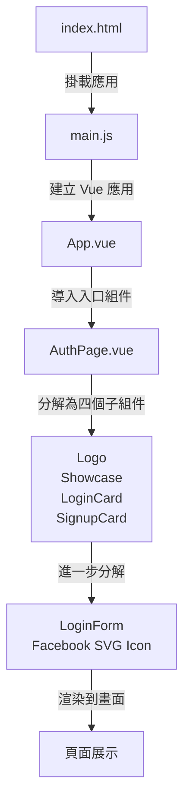
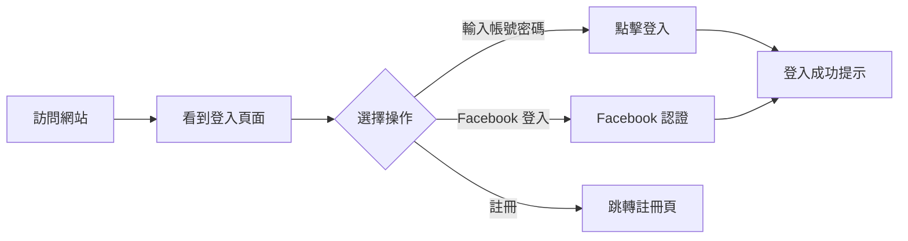
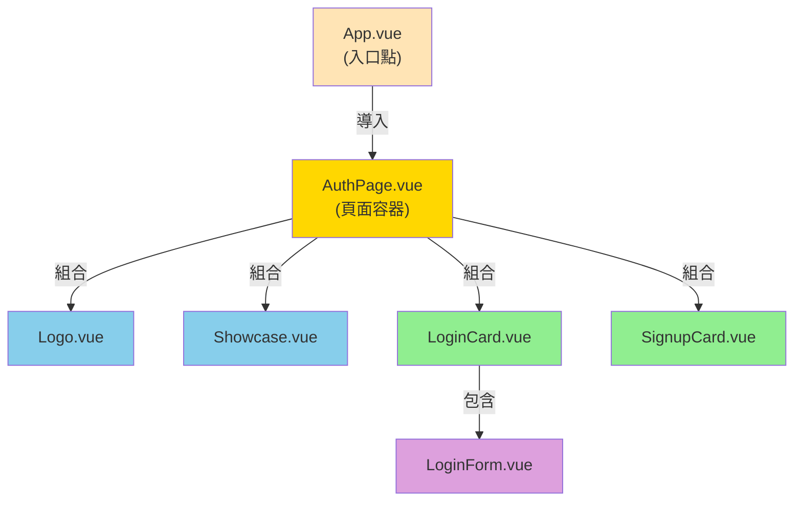

# Vue.js SFC 元件化網站實作

## 基本資訊

| 項目         | 內容               |
| ------------ | ------------------ |
| **姓名**     | 王奕智             |
| **班級**     | 資訊二丁           |
| **網站標題** | Instagram 登入頁面 |
| **技術框架** | Vue.js 3 (SFCs)    |

---

## 📋 專案概述

本專案使用 **Vue.js 3 的 Single File Components (SFCs)** 開發一個仿 Instagram 登入頁面。透過元件化設計，將頁面分解成可重用的獨立元件，展示現代前端開發的最佳實踐。

### 主要特性

✅ 元件化架構（Component-Based Architecture）  
✅ 響應式狀態管理（Reactive State Management）  
✅ 作用域樣式隔離（Scoped Styling）  
✅ 表單驗證與互動  
✅ 清晰的檔案結構

---

## 🎯 執行流程與畫面

### 應用啟動流程



### 使用者互動流程



### 頁面布局結構

```
┌─────────────────────────────────────┐
│  Logo (44×44px) - 左上角             │
├─────────────────────────────────────┤
│                                       │
│   ┌──────────────┐    ┌──────────┐  │
│   │              │    │ Login    │  │
│   │  Showcase    │    │ Card     │  │
│   │  (示例圖)    │    │ ┌──────┐ │  │
│   │  300×520px   │    │ │Form  │ │  │
│   │              │    │ └──────┘ │  │
│   │              │    └──────────┘  │
│   │              │    ┌──────────┐  │
│   │              │    │ Signup   │  │
│   │              │    │ Card     │  │
│   │              │    └──────────┘  │
│   └──────────────┘                  │
└─────────────────────────────────────┘
```

---

## 🧩 元件介紹

### 1. **Logo.vue** - Logo 元件

**位置：** `src/components/Logo.vue`

```vue
<template>
  <a class="top-left-logo" href="#" aria-label="首頁">
    
  </a>
</template>
```

| 屬性     | 值                     |
| -------- | ---------------------- |
| **功能** | 顯示網站 Logo          |
| **大小** | 44×44 px               |
| **位置** | 頁面左上角（絕對定位） |
| **互動** | 點擊返回首頁           |

---

### 2. **Showcase.vue** - 展示區元件

**位置：** `src/components/Showcase.vue`

```vue
<template>
  <aside class="showcase">
    <div class="phone">
      <div class="screen">
        
      </div>
    </div>
  </aside>
</template>
```

| 屬性         | 值                        |
| ------------ | ------------------------- |
| **功能**     | 顯示產品示例              |
| **視覺效果** | 手機模型外框（300×520px） |
| **內容**     | demo.jpg 圖片             |

---

### 3. **LoginCard.vue** - 登入卡片

**位置：** `src/components/LoginCard.vue`

```vue
<template>
  <div class="card auth-card">
    <h1 class="logo"><span class="grad">Instagram</span></h1>
    <LoginForm />
  </div>
</template>
```

| 屬性         | 值                         |
| ------------ | -------------------------- |
| **功能**     | 登入表單的容器             |
| **內容**     | 網站標題 + LoginForm 元件  |
| **樣式**     | 白色卡片，邊框，圓角，陰影 |
| **包含元件** | `<LoginForm />`            |

---

### 4. **LoginForm.vue** - 登入表單

**位置：** `src/components/LoginForm.vue`

```vue
<script setup>
const user = ref("");
const password = ref("");
const showPassword = ref(false);
const isLoading = ref(false);

const handleSubmit = async () => {
  isLoading.value = true;
  // 模擬登入延遲
  await new Promise((resolve) => setTimeout(resolve, 900));
  alert("登入成功（範例）");
};
</script>

<template>
  <form @submit.prevent="handleSubmit">
    <input
      v-model="user"
      type="text"
      placeholder="電話、使用者名稱或電子郵件"
    />
    <div class="pw-row">
      <input
        v-model="password"
        :type="showPassword ? 'text' : 'password'"
        placeholder="密碼"
      />
      <button type="button" @click="togglePassword">
        {{ showPassword ? "隱藏" : "顯示" }}
      </button>
    </div>
    <button class="btn primary" type="submit" :disabled="!isFormValid">
      {{ isLoading ? "登入中…" : "登入" }}
    </button>
    <button type="button" class="btn fb" @click="loginWithFacebook">
      以 Facebook 登入
    </button>
    <a class="forgot" href="#">忘記密碼？</a>
  </form>
</template>
```

**功能列表：**

| 功能              | 說明                              |
| ----------------- | --------------------------------- |
| **帳號輸入**      | 支援電話、使用者名稱或電子郵件    |
| **密碼輸入**      | 預設隱藏，可點擊「顯示/隱藏」切換 |
| **登入驗證**      | 帳號和密碼都不為空才啟用按鈕      |
| **Facebook 登入** | 第三方登入選項                    |
| **忘記密碼**      | 超連結到重設密碼頁面              |
| **載入狀態**      | 登入中顯示「登入中…」             |

**互動邏輯：**

```javascript
// 表單驗證
const isFormValid = computed(() =>
  user.value.trim() && password.value.trim()
);

// 密碼顯示切換
togglePassword() → showPassword 反轉

// 登入流程
handleSubmit() → isLoading = true → 延遲 900ms → 顯示成功 → isLoading = false
```

---

### 5. **SignupCard.vue** - 註冊卡片

**位置：** `src/components/SignupCard.vue`

```vue
<template>
  <div class="card signup-card">沒有帳號嗎？ <a href="#">註冊</a></div>
</template>
```

| 屬性     | 值                    |
| -------- | --------------------- |
| **功能** | 引導未登記使用者註冊  |
| **內容** | 純文字提示 + 註冊連結 |
| **樣式** | 同 LoginCard 風格     |

---

### 6. **AuthPage.vue** - 認證頁面（容器元件）

**位置：** `src/components/AuthPage.vue`

```vue
<template>
  <div class="page">
    <Logo />
    <div class="stage">
      <Showcase />
      <section class="auth-area">
        <LoginCard />
        <SignupCard />
      </section>
    </div>
  </div>
</template>

<script setup>
import Logo from "./Logo.vue";
import Showcase from "./Showcase.vue";
import LoginCard from "./LoginCard.vue";
import SignupCard from "./SignupCard.vue";
</script>
```

| 屬性         | 值                                    |
| ------------ | ------------------------------------- |
| **角色**     | 容器元件（Container Component）       |
| **職責**     | 組織所有子元件的布局                  |
| **布局**     | Flexbox 兩欄設計                      |
| **包含元件** | Logo, Showcase, LoginCard, SignupCard |

---

## 🏗️ 元件樹結構

```
App.vue
└── AuthPage.vue (認證頁面)
    ├── Logo.vue (Logo)
    ├── Showcase.vue (展示區)
    └── auth-area (區塊)
        ├── LoginCard.vue (登入卡片)
        │   └── LoginForm.vue (登入表單)
        └── SignupCard.vue (註冊卡片)
```

### 元件互動關係



---

## 🎨 樣式架構

### 全局樣式

**檔案：** `src/assets/base.css`

```css
:root {
  --bg: #fafafa; /* 背景色 */
  --card: #fff; /* 卡片色 */
  --muted: #8e8e8e; /* 文字灰色 */
  --primary: #0095f6; /* 主要藍色 */
  --fb: #1877f2; /* Facebook 藍 */
  --border: #dbdbdb; /* 邊框色 */
  --shadow: 0 4px 10px rgba(0, 0, 0, 0.08);
  --radius: 6px; /* 圓角大小 */
}
```

### 元件樣式隔離

每個元件使用 `<style scoped>` 限制樣式只作用於該元件：

```vue
<style scoped>
/* 只作用於此元件內的元素 */
.top-left-logo {
  position: absolute;
  top: 18px;
  left: 18px;
}
</style>
```

---

## 📂 檔案結構

```
SFCs-vue/
├── index.html                    # HTML 進入點（保持乾淨）
├── main.js                       # Vue 應用程式進入點
├── vite.config.js               # Vite 組態
├── package.json                 # 專案依賴
│
├── src/
│   ├── App.vue                  # 根元件
│   ├── main.js                  # 應用初始化
│   │
│   ├── assets/
│   │   ├── base.css            # 全局變數 & 基礎樣式
│   │   ├── main.css            # 主樣式表
│   │   ├── logo.png            # Logo 圖片
│   │   └── demo.jpg            # 展示圖片
│   │
│   └── components/
│       ├── AuthPage.vue         # 頁面容器
│       ├── Logo.vue             # Logo 元件
│       ├── Showcase.vue         # 展示區元件
│       ├── LoginCard.vue        # 登入卡片
│       ├── LoginForm.vue        # 登入表單
│       └── SignupCard.vue       # 註冊卡片
│
└── public/
    └── favicon.ico              # 網站 Icon
```

---

## 🚀 如何運行

### 1. 安裝依賴

```bash
npm install
```

### 2. 啟動開發伺服器

```bash
npm run dev
```

### 3. 在瀏覽器開啟

```
http://localhost:5173
```

### 4. 構建生產版本

```bash
npm run build
```

---

## 💡 關鍵技術解析

### Vue 3 Composition API (`<script setup>`)

```vue
<script setup>
import { ref, computed } from "vue";

// 響應式狀態
const user = ref("");
const password = ref("");

// 計算屬性
const isFormValid = computed(() => user.value.trim() && password.value.trim());

// 方法
const handleSubmit = () => {
  // 邏輯
};
</script>
```

**優點：**

- ✅ 代碼更簡潔
- ✅ 更好的 TypeScript 支持
- ✅ 更直覺的邏輯組織

### v-model 雙向綁定

```vue
<input v-model="user" type="text" />
<!-- 自動同步 input 值與 user 變數 -->
```

### 條件式渲染

```vue
<input :type="showPassword ? 'text' : 'password'" />
<!-- 根據 showPassword 切換 input 類型 -->
```

### 事件處理

```vue
<button @click="togglePassword">
  {{ showPassword ? "隱藏" : "顯示" }}
</button>
<!-- @click 綁定事件處理函數 -->
```

### 表單提交

```vue
<form @submit.prevent="handleSubmit">
  <!-- @submit.prevent 防止預設表單提交 -->
</form>
```

---

## 📚 學習重點

### 1. 元件化思維

- 將大頁面拆解成小元件
- 每個元件單一職責
- 通過元件組合構建完整頁面

### 2. 狀態管理

- 使用 `ref()` 創建響應式變數
- 使用 `computed()` 創建計算屬性
- 狀態變化自動更新視圖

### 3. 檔案結構

```
保持根目錄乾淨
    ↓
main.js 只處理應用初始化
    ↓
App.vue 保持簡單
    ↓
邏輯放入 components/
```

### 4. 樣式隔離

- 使用 `<style scoped>` 避免樣式衝突
- CSS 變數統一管理色系
- 元件樣式獨立維護

---

## 🎓 進階擴展建議

### 可以試著做的改進：

1. **路由（Vue Router）**
   - 添加註冊頁面
   - 實現頁面跳轉

2. **狀態管理（Pinia）**
   - 用戶登入狀態保存
   - 全局狀態管理

3. **API 整合**
   - 連接真實後端 API
   - 實現真實登入功能

4. **表單驗證**
   - Email 格式驗證
   - 密碼強度檢查

5. **響應式設計**
   - 行動版適配
   - 不同螢幕尺寸最佳化

---

## 📝 總結

本專案展示了如何使用 **Vue 3 SFCs** 建立一個模組化、可維護的前端應用。透過合理的元件拆分和清晰的檔案結構，使得代碼易於理解、測試和擴展。

**核心原則：**

1. ✅ **單一職責** - 每個元件只做一件事
2. ✅ **可重用** - 元件可獨立使用
3. ✅ **易維護** - 代碼組織清晰
4. ✅ **易測試** - 元件邏輯獨立

---

**製作者：王奕智 | 班級：資訊二丁 | 日期：2026-06-10**
